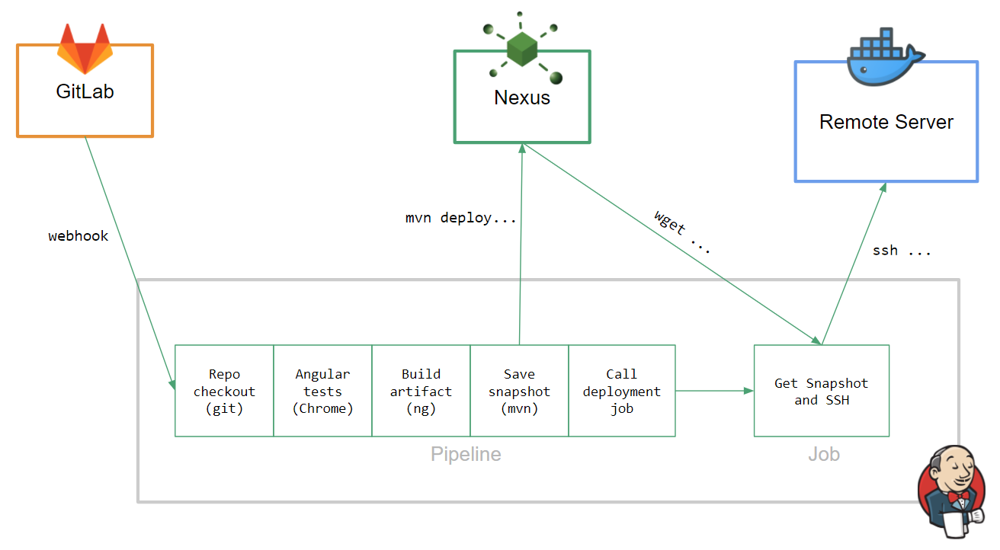

# Jenkins Session Angular project

This Angular project is prepared to be executed in a CI/CD environment, adding some stuff:

## 1. `java/` directory

From this folder we can execute a `mvn deploy` and Maven will push the zipped artifact (just a zipped `dist/` directory created by `ng build [...]`) and push it to the [specified Nexus URL](https://github.com/cbelda/jenkins-session/blob/master/java/pom.xml#L30-L36). To achieve that we'll need 2 files:

- `pom.xml`
- `resource.xml`

## 2. `jenkins/` directory

Both pipeline and job content (the Job is completed with the script created in the [deployment directory](https://github.com/cbelda/jenkins-session/tree/master/deployment)).

- `Jenkinsfile` (groovy script for the **Pipeline**)
- `get-artifact.sh``(first step of the deployment **Job**)

## 3. `deployment/` directory

The `deploy.sh` could be placed beforehand in the Remote Server used for deployment. It contains some Docker commands to restart the application (in this case, to restart an NGINX container that serves the Angular client's artifact).

It will be executed as a final step of the CI/CD process.